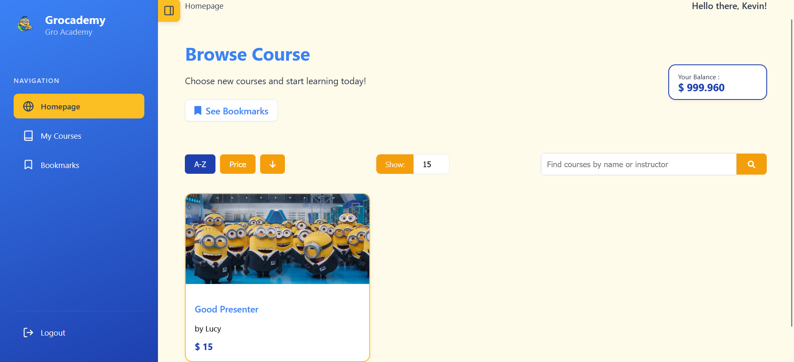
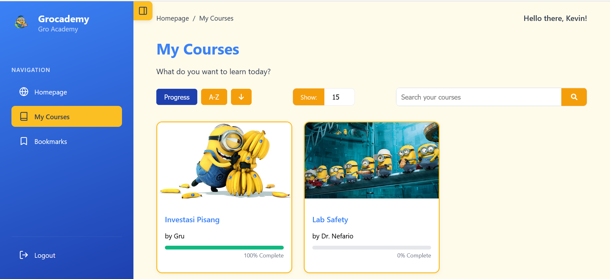
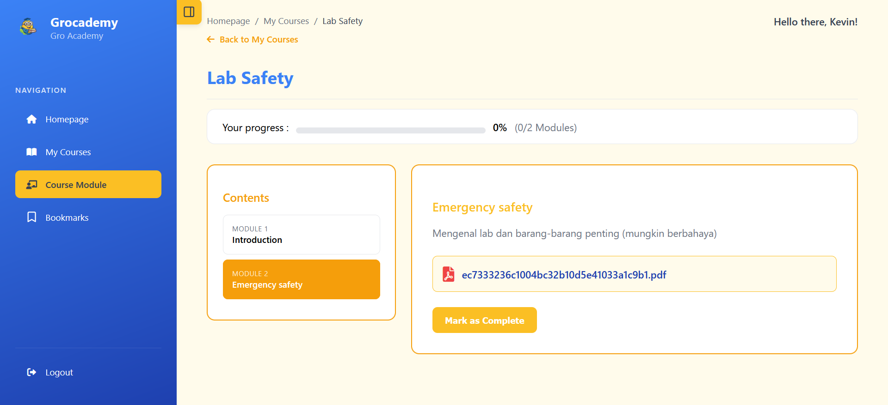
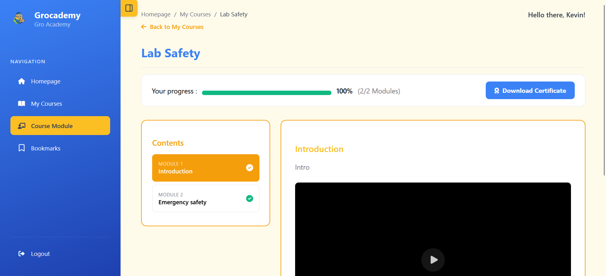
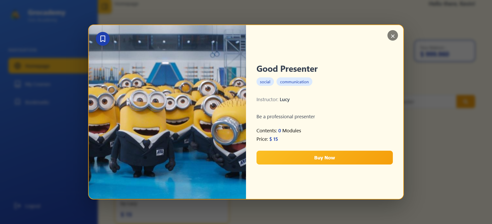
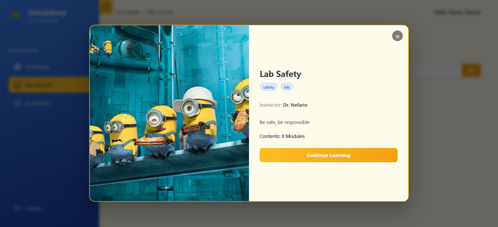
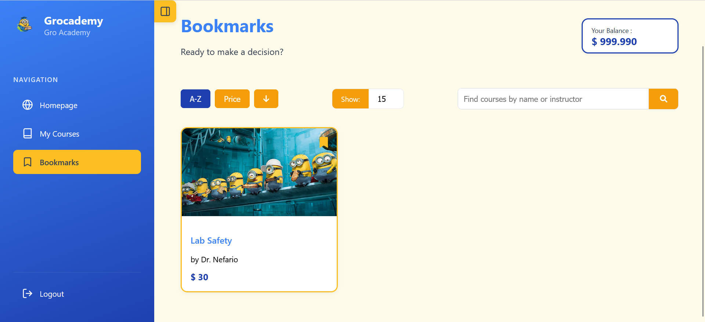

# Grocademy - Platform E-Learning

Selamat datang di Grocademy, sebuah platform pembelajaran digital yang dirancang agar edukatif dan menyenangkan, cocok untuk semua Nimon di laboratorium Gro.

**Screenshot Aplikasi:**

*Halaman Browse Course*


*Halaman My Course*


*Halaman Modul*



*Course Detail*



*Halaman Bookmark*


---

## Identitas Diri
* **Nama**: Ferdin Arsenarendra Purtadi
* **NIM**: 13523117

---

## Technology Stack

### Backend
* **Framework**: NestJS 11
* **Bahasa**: TypeScript 5.7
* **Database**: PostgreSQL 13
* **ORM**: Prisma 6.13
* **Otentikasi**: JWT (JSON Web Tokens)
* **File Upload**: Multer
* **PDF Generation**: PDFKit
* **Caching**: Redis

### Frontend
* **Bahasa**: Vanilla HTML, CSS, JavaScript (ES6+)
* **Server Development**: live-server
* **Styling**: CSS Variables & Flexbox/Grid

### Environment
* **Containerization**: Docker & Docker Compose

---

## Cara Menjalankan Aplikasi

Aplikasi ini telah di-"Dockerize" untuk kemudahan setup. Pastikan Anda memiliki **Docker** dan **Docker Compose** terinstall di sistem Anda.

### 1. Clone Repository
```bash
git clone https://github.com/Ferdin-Arsenic/Grocademy-13523117.git
cd Grocademy-13523117
```

### 2. Buat File Environment Backend
Buat file `.env` di dalam folder `backend/`.
```bash
cd backend
echo "DATABASE_URL=\"postgresql://user:password@db:5432/grocademydb?schema=public\"" > .env
echo "JWT_SECRET=\"SECRET_KEY_YANG_SANGAT_RAHASIA\"" >> .env
echo "REDIS_HOST=\"cache\"" >> .env
echo "REDIS_PORT=6379" >> .env
cd ..
```

### 3. Jalankan Aplikasi (Alur Kerja 2 Terminal)

**Terminal 1 - Menjalankan Backend & Database**
Buka terminal pertama di direktori utama proyek, lalu jalankan:
```bash
docker compose up --build
```

Biarkan terminal ini berjalan. Perintah ini akan membangun *image*, menjalankan migrasi & *seeding* database secara otomatis, dan menyalakan server backend.

**Terminal 2 - Menjalankan Frontend**
Buka terminal baru, lalu jalankan:
```bash
cd frontend
live-server
```

Browser akan otomatis terbuka di `http://127.0.0.1:8080`, dan Anda akan diarahkan ke halaman login.

### 4. Akses Aplikasi
* **Frontend**: `http://localhost:8080` atau `http://127.0.0.1:8080`
* **Backend API**: `http://localhost:3000/api`

### Akun Admin Default
Akun admin default dibuat secara otomatis saat pertama kali dijalankan:
* **Email/Username**: admin@grocademy.com
* **Password**: admin123
akun admin akan dibuat ulang setiap kali docker compose up

---

## Endpoint API yang Dibuat

Semua *endpoint* berada di bawah prefix global `/api`.

### Auth (`/api/auth`)
* `POST /register`: Mendaftarkan pengguna baru.
* `POST /login`: Login pengguna dan mendapatkan JWT.
* `GET /self`: Mendapatkan detail pengguna yang sedang login.

### Users (`/api/users`)
* `GET /`: Menampilkan semua pengguna (Admin).
* `GET /:id`: Menampilkan detail satu pengguna (Admin).
* `POST /:id/balance`: Menambah saldo ke pengguna (Admin).
* `PATCH /:id`: Memperbarui data pengguna (Admin).
* `DELETE /:id`: Menghapus pengguna (Admin).

### Courses (`/api/courses`)
* `GET /`: Menampilkan semua kursus (publik, dengan search, sort, & pagination).
* `GET /:id`: Menampilkan detail satu kursus.
* `POST /`: Membuat kursus baru dengan gambar (Admin).
* `PATCH /:id`: Memperbarui kursus (Admin).
* `DELETE /:id`: "Menghapus" kursus dengan metode soft delete (Admin).
* `POST /:id/buy`: Membeli kursus (User).
* `GET /user/my-courses`: Menampilkan semua kursus yang sudah dibeli (User).
* `GET /:id/modules`: Menampilkan semua modul dari kursus yang sudah dibeli (User).

### Modules (`/api/modules`)
* `POST /`: Membuat modul baru dengan PDF dan/atau Video (Admin).
* `GET /:id`: Menampilkan detail satu modul.
* `PATCH /:id`: Memperbarui modul (Admin).
* `DELETE /:id`: Menghapus modul (Admin).
* `POST /reorder`: Mengubah urutan modul (Admin).
* `PATCH /:id/complete`: Menandai modul sebagai selesai (User).

### Bookmarks (`/api/bookmarks`)
* `GET /`: Menampilkan kursus yang di-*bookmark* (User).
* `POST /:courseId`: Menambah/menghapus *bookmark* (User).

### Certificate (`/api/certificate`)
* `GET /:courseId`: Mengunduh sertifikat dalam format PDF (User).

---

## Design Pattern yang Digunakan

1. **Singleton Pattern**: `PrismaService` dan semua service lain di NestJS diimplementasikan sebagai *singleton*. Ini memastikan hanya ada satu instans dari setiap service yang digunakan di seluruh aplikasi, yang meningkatkan efisiensi dan konsistensi.

2. **Repository Pattern (via Prisma)**: Prisma Client bertindak sebagai lapisan abstraksi (Repository) antara logika bisnis (*service*) dan database. Ini memisahkan cara data diakses dari logika aplikasi, membuat kode lebih mudah diuji dan dikelola.

3. **Decorator Pattern**: Digunakan secara ekstensif oleh NestJS untuk fungsionalitas seperti *routing* (`@Controller`, `@Get`), validasi (`@Body`), dan keamanan (`@UseGuards`, `@Roles`), memungkinkan penambahan fungsionalitas secara deklaratif.

---

## Bonus yang Dikerjakan

1. **B03 - Polling**: Halaman *Browse Course* akan otomatis memeriksa kursus baru setiap 5 detik dan menampilkannya tanpa perlu *refresh*.

2. **B04 - Caching**: *Endpoint* `GET /courses` menggunakan Redis untuk *caching* guna mempercepat waktu respons pada permintaan berulang. Invalidasi *cache* terjadi secara otomatis saat ada perubahan data kursus.

3. **B10 - Fitur Tambahan (Bookmark)**: Pengguna yang sudah login dapat menyimpan kursus yang mereka minati dengan fitur *bookmark*.

---

## Struktur Database

### Tabel User
- id, email, name, password, role, balance, createdAt, updatedAt

### Tabel Course
- id, title, description, price, imageUrl, createdAt, updatedAt, deletedAt

### Tabel Module
- id, courseId, title, contentType, contentUrl, order, createdAt, updatedAt

### Tabel UserCourse (Pembelian Kursus)
- id, userId, courseId, purchaseDate

### Tabel UserModuleProgress (Progress Modul)
- id, userId, moduleId, completedAt

### Tabel Bookmark
- id, userId, courseId, createdAt

---

## Fitur Utama

### Untuk User
- Registrasi dan login dengan JWT authentication
- Browse kursus dengan pencarian dan pagination
- Membeli kursus menggunakan saldo
- Melihat kursus yang sudah dibeli
- Mengakses modul dari kursus yang dibeli
- Menandai modul sebagai selesai
- Menyimpan kursus favorit dengan bookmark
- Download sertifikat setelah menyelesaikan kursus

### Untuk Admin
- Login dengan akun admin
- Mengelola semua pengguna
- Menambah saldo pengguna
- Membuat, mengubah, dan menghapus kursus
- Membuat, mengubah, dan menghapus modul
- Upload gambar untuk kursus
- Upload PDF dan video untuk modul
- Mengatur urutan modul dalam kursus

---

## Security Features

- JWT Token authentication
- Role-based access control (Admin/User)
- Password hashing menggunakan bcrypt
- Input validation dan sanitization
- Protected routes berdasarkan peran pengguna

---

## Performance Features

- Redis caching untuk endpoint courses
- Efficient database queries dengan Prisma
- Optimized image serving
- Pagination untuk large datasets
- Soft delete untuk data integrity
